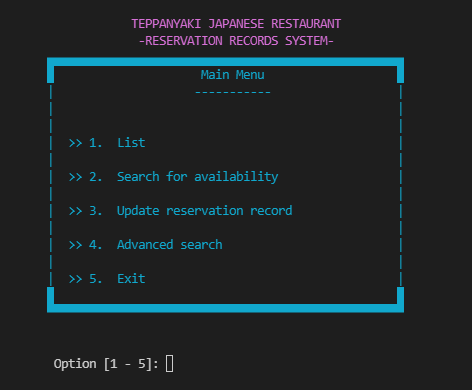
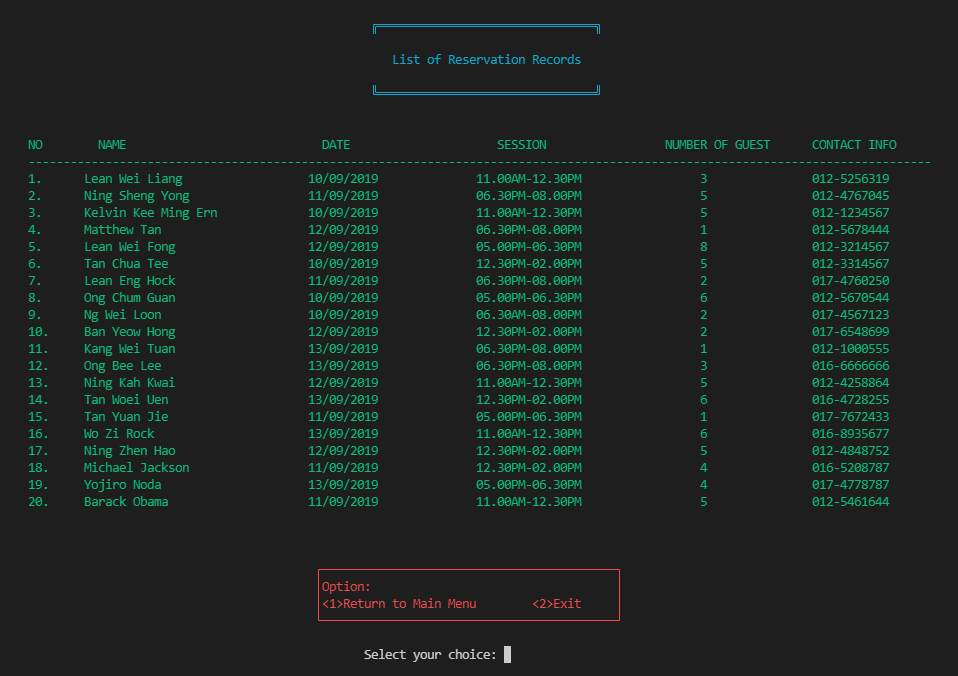
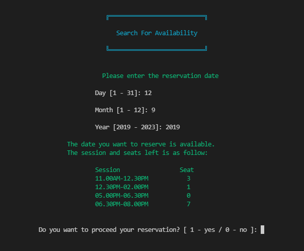
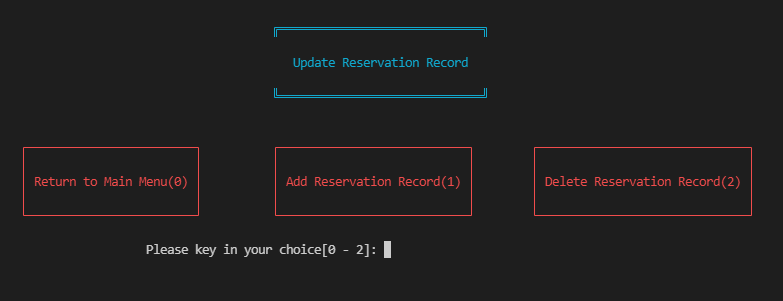
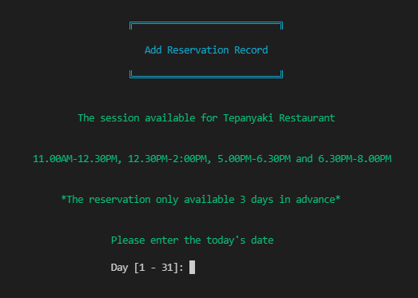
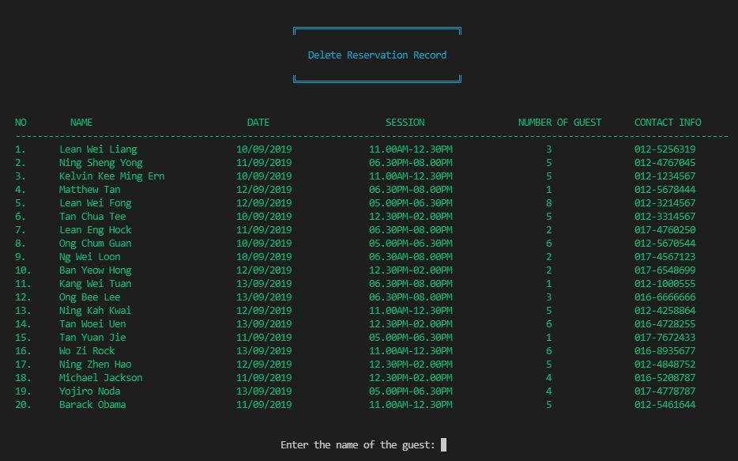
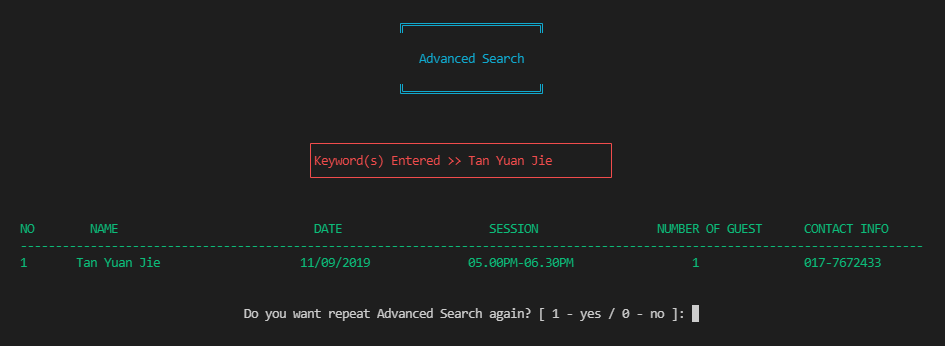
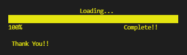

# RestaurantReservationSystem

## Overview

A Teppanyaki Japanese restaurant serves supreme quality meal for their guests. Guests have a front row seat on how Master chef prepares their dishes. Their authentic setting places guests in a traditional Japanese style establishment and fits perfectly to its cuisine and feel.

Due to popular demand and limited seating availability, guests have to reserve seats at least 3 days in advance for enjoying meal at their restaurant. The restaurant only serves 4 sessions (11:00am – 12:30pm, 12:30pm – 2:00pm, 5:00pm – 6:30pm and 6:30pm – 8:00pm) each day and each session only serves 8 guests.

Therefore, this system is developed to help in processing the reservation records. Additionally, this system applies structured programming approach.

The functions of the system are as follows:

1. **List**   Display the reservation records. Each display should contain an appropriate heading and column captions.  
2. **Search for Availability**   Search for the availability in the list using the date, time and number of guests.  
3. **Update Reservation Record**   Ask user for date, time and number of guests. Then search for availability in the list using the input data.  
4. **Exit**   Stop the program. The program will write the updated data in the list to the file.  
5. **Advanced Search**   Search for guest record(s) in the list using the name or phone number.  

## Tools
1. C++

## Usage
Import the files into the project.  
Run the project with C++ compiler.

## Test
Manual testing has been performed.

## Previews
1. MainMenu     
2. List     
3. Search for Availability     
4. Update Reservation Record     
5. Add Reservation     
6. DeleteReservation     
7. Advanced Search     
8. Exit     

## Contributors
1. Lean Wei Liang
2. Seow Kai Sheng
3. Tan Teck Song
4. Tan Yuan Jie
